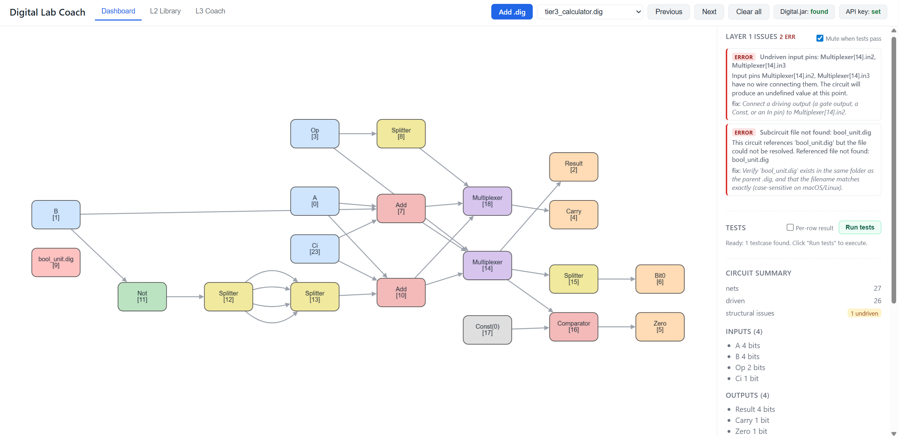

# Digital Lab Coach (DLC)

A hybrid deterministic-checker + LLM feedback tool for student debugging
in Digital circuit simulator labs. Path 1 (external
companion tool) prototype. 



## Status

Active development.

## File Layout

| Path | Role |
|---|---|
| `dlc/parser/` | Reads `.dig` XML into structured Python objects: components, wires, nets, signal-flow graph. 
| `dlc/facts/` | Extracts a JSON-serializable bundle of facts the LLM and deterministic checkers consume: inventory, per-net widths, per-component topology, structural bug list.
| `dlc/testing/` | Reads each Testcase's embedded test rows out of the `.dig`, parses Digital's CLI output, and optionally runs Digital one row at a time to pinpoint which specific rows fail. 
| `dlc/analyzer/` | Deterministic checkers — wire completeness, bit widths, combinational loops, interface conformance, sequential timing. 
| `dlc/llm/` | LLM client wrapper and versioned prompts for conceptual explanation (Layer 2) and strategic debugging (Layer 3). 
| `dlc/evaluator/` | Benchmark harness that scores feedback quality against the 30-bug circuit set. 
| `dlc/telemetry/` | Per-interaction logging to a local SQLite database. 
| `dlc/cli/` | Command-line entrypoint that wires the layers together for student use. 
| `prompts/` | Versioned LLM prompt templates — one file per prompt variant, consumed by `dlc/llm/`. 
| `configs/` | Per-lab YAML configs (expected I/Os, handout context etc.). 
| `data/sample_circuits/` | Test fixtures — public sample circuits created by authors. 
| `docs/` | Architecture notes, design decisions, dev log, dev debug guide. 
| `tests/` | pytest unit tests, one file per source module. 

## Temp Web testing

By May 2026, The Layer 1 + Layer 2 demo runs as a local web app.
Open it in a browser, point it at one or more `.dig` files, and
you get the interactive graph, structural-issue verlay, per-row 
test runner, component library, and the Layer 2 conceptual coach.

Try the early web version by going over developer setup and running 
the command below:

```bash
# From the repo root:
uv sync                              
uv run python -m dlc.web.server      
```

## Developer setup (For best experience, run the set up and testing flow using bash)

If you're contributing to DLC:

Need Python version >=3.12, 3.12 would be the best for developing

**Linux only — install tkinter at the OS level:**
`uv`-managed Python and many distro Pythons don't bundle tkinter.
DLC needs it for the first-run Digital.jar file-picker dialog and
for 3 file-picker tests in the suite. macOS and Windows ship tkinter
with python.org Python — skip this step there.

```bash
# Debian / Ubuntu
sudo apt install python3-tk
# Fedora / RHEL
sudo dnf install python3-tkinter
# Arch
sudo pacman -S tk
```

**General:**
```bash
# Install uv once (skip if already installed)
# macOS / Linux:
curl -LsSf https://astral.sh/uv/install.sh | sh
# Windows PowerShell:
powershell -ExecutionPolicy ByPass -c "irm https://astral.sh/uv/install.ps1 | iex"

# Clone and run tests
git clone <repo-url>
cd digital-lab-coach
uv run pytest      # creates .venv on first call
```
After all tests green, you are all set and feel free to try temp web testing!

**Side notes**

>   The shell installer only updates the shell it's run from. If you
>   install `uv` via Git Bash but want to use it from PowerShell, run
>   the PowerShell installer too.

>   After install, **close and reopen** your terminal (restart VS Code
>   if it still can't find `uv`.)

>   In Git Bash, prefer forward slashes (`C:/Users/...`)

>   PowerShell doesn't always parse multi-line `python -c "..."` blocks
>   cleanly. For the `test_notes.md` manual tests, use Git Bash, or save
>   the script to a `.py` file and run `uv run python script.py`.

> **Students:** same setup applies until we ship a packaged release.
> Install `uv`, clone, and `uv run` whatever entry point we land for
> the student CLI/GUI later. The first run pops up the Digital.jar file
> picker.

## User and Developer Optional setup: Digital.jar for per-row test verification

DLC's structural analysis works on any `.dig` file with no extra setup.

**For per-row pass/fail diagnostics and failing test analysis**, the tool 
runs Digital's CLI as a subprocess, so it needs to know where your `Digital.jar` is.

### Setting it up
Download Digital from
<https://github.com/hneemann/Digital>, extract anywhere, and let the first-run dialog find your jar.

If you'd rather configure it manually:

```bash
# Option A 
uv run python -c "from dlc.testing.config import set_digital_jar_path; set_digital_jar_path(r'PATH_TO_YOUR_Digital.jar')"

# Option B 
# macOS / Linux
export DIGITAL_JAR=/path_to_Digital/Digital.jar
# Windows PowerShell
$env:DIGITAL_JAR = "C:\path_to_Digital\Digital.jar"
```

## License

GPL-3.0. See LICENSE.

## Upstream

Built to read .dig files produced by [Digital](https://github.com/hneemann/Digital),
an open-source educational circuit simulator (GPL-3.0).

